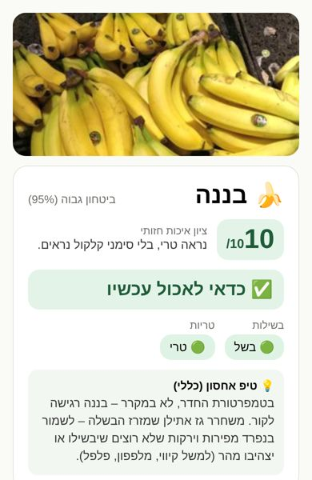
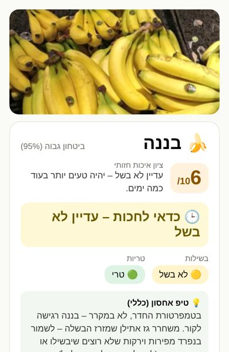
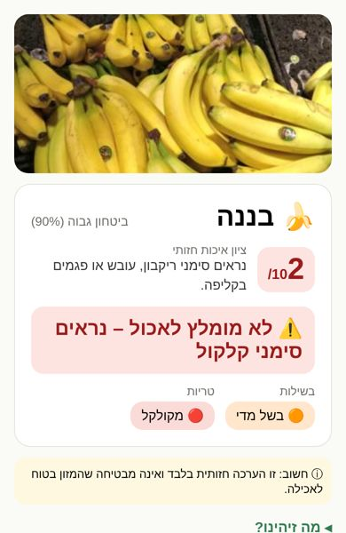
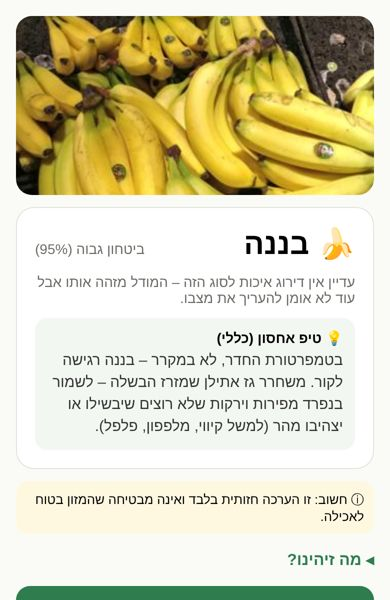

# Visual quality score (1–10) and its explanation

Every successful scan returns `score` (1–10, or none) and `score_reason_he` (one short Hebrew sentence). They're computed in `ml/inference/decision.py::quality_score`. The app's TS port (`app/src/model/decision.ts::qualityScore`) matches it exactly on 600 generated cases (`app/__tests__/decision.parity.test.ts`).

## How the number is made

The model has three quality heads. Each one that is **trained and validated for this produce type** (`supported_heads` in the model bundle) contributes an *expected* score over its probabilities:

| Head | Class → points |
|---|---|
| freshness | fresh 10 · declining 6 · spoiled 1 |
| visual spoilage | none 10 · mild 5 · severe 1 |
| ripeness (only types where ripeness is visible, see produce-science.md) | unripe 5 · partially ripe 8 · ripe 10 · overripe 6 |

- **The worst head decides**, so a ripe banana with mould scores low. The value is rounded to 1–10.
- When the recommendation is "discard" (the spoilage alert fires), the score is capped at **2**.
- When the heads are available but not confident (recommendation "check manually"), **no number is shown**: "לא ניתן לדרג בביטחון מהתמונה הזו…"
- When the type has no trained quality heads, **no number is shown**: "עדיין אין דירוג איכות לסוג הזה…". The app never shows a score it can't back.

The explanation names the deciding reason:

| Case | Explanation |
|---|---|
| Score ≥ 8 | "נראה טרי, בלי סימני קלקול נראים." |
| Spoilage decided | "נראים סימני ריקבון, עובש או פגמים בקליפה." |
| Freshness decided | "המראה מתאים לפרי שהתקלקל." or "מתחיל לאבד טריות – כדאי לאכול בקרוב." |
| Ripeness decided | "עדיין לא בשל – יהיה טעים יותר בעוד כמה ימים." or "בשל מאוד – לאכול היום או להשתמש לאפייה." |

The score describes **what the photo shows**, never safety. The disclaimer stays on every result, and the discard explanation adds the Ministry of Health mould rule.

Rendered (synthetic head outputs;  good ·  unripe ·  spoiled ·  type without a trained quality model).

## When a fruit gets a score (training requirement)

A quality head is switched on for a produce type only when training has enough **exactly labelled** examples: at least 200, with at least 2 classes of at least 50 each (`supported_heads_from_manifest`). Ripeness is also vetoed where it isn't visible. The release gates then check the head on held-out photos.

**Status 27 Sep 2026:** no produce type qualifies yet. The model is trained, but not on quality labels, because none legally usable were reachable:
- lemons (mould, MIT): only one exact class ("none"), since mould is set-valued mild/severe;
- bananas (ripeness, MIT): 150 exact labels, below the 200 minimum.

What switches scores on, type by type, is in [dataset-search-2026-09.md](dataset-search-2026-09.md) §F: the Mendeley freshness and ripeness sets, the web-CC crawl plus grading, and our own graded photos. **No code change is needed.** Retraining writes `supported_heads`, and the score appears for each type that passes.
