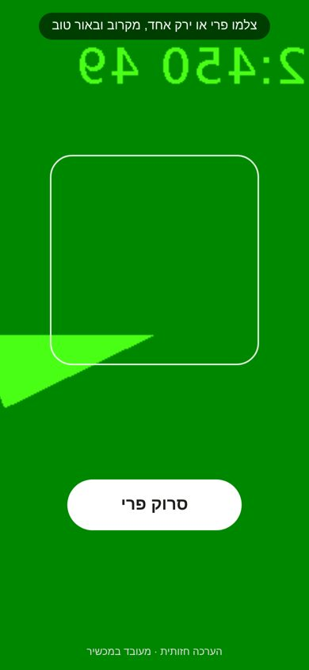
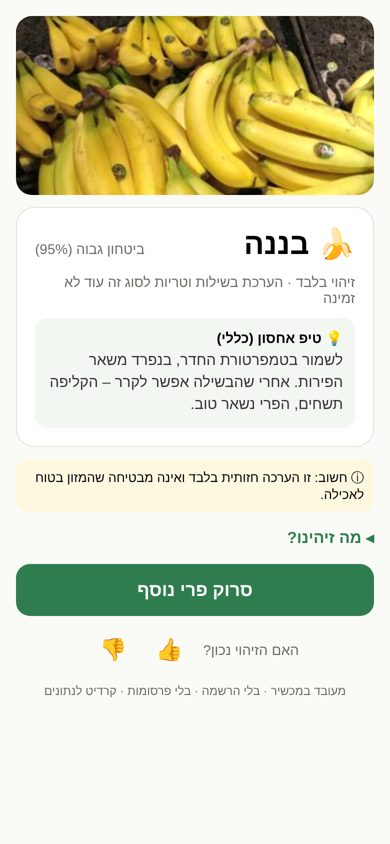
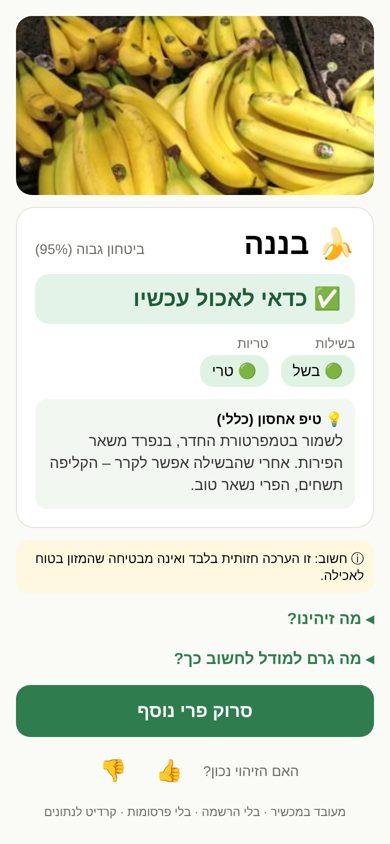
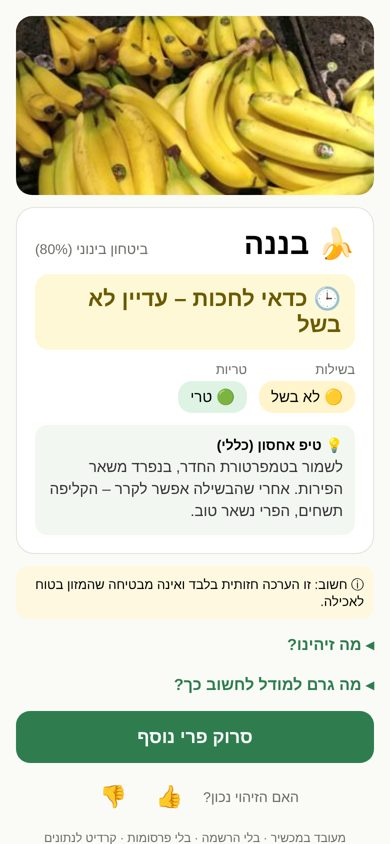
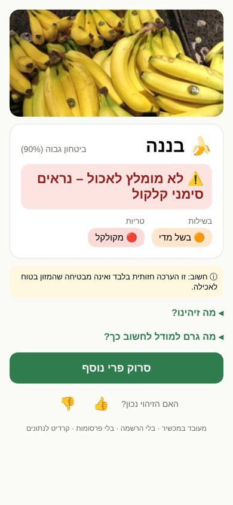
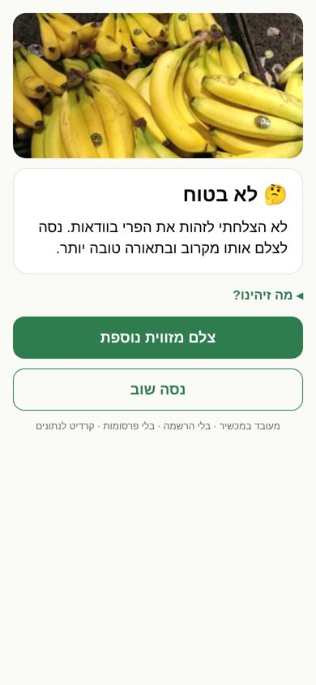
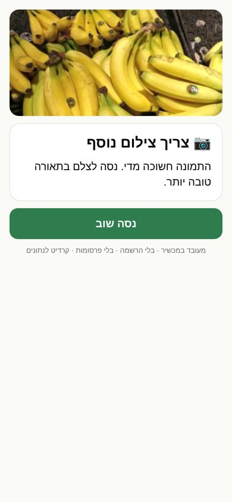
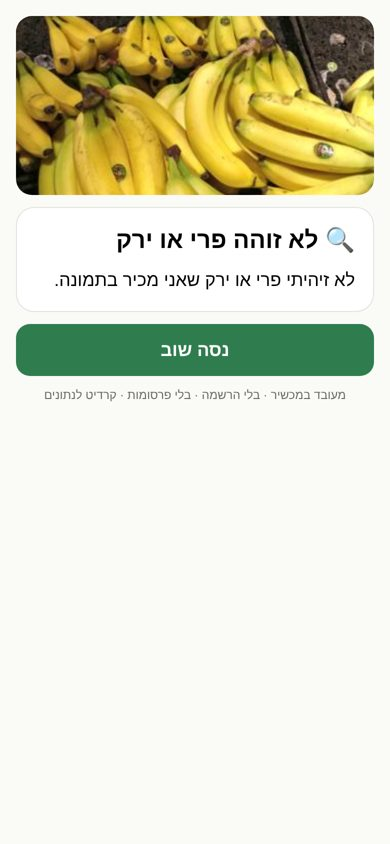

# UI review — rendered screens (2026-09-26)

Rendered from the app's real screens with `react-native-web` at 390×844 in RTL, driven by real
`decide()` outputs (a temporary demo route, removed after capture). The camera screen uses Chromium's
fake camera feed (green test pattern). Native iOS still has to be checked on a device (Phase 6/7).
Demo photo: Grocery Store Dataset (MIT, Klasson et al. 2019).

| Camera | Identify only (today's real state) | Assessment available | Medium confidence |
|---|---|---|---|
|  |  |  |  |

| Spoiled → red "don't eat" | Unsure → second angle | Bad photo | Not produce |
|---|---|---|---|
|  |  |  |  |

## Problems found by rendering, and fixes

| # | Problem (first render) | Fix |
|---|---|---|
| 1 | Identify-only result: big green headline "לא ניתן להעריך בוודאות – מומלץ לבדוק ידנית" undercut a 95%-confident identification; two grey "not available" chips wasted space | Headline shown only when ripeness/freshness is actually assessed; otherwise one quiet line "זיהוי בלבד · …", and the storage tip becomes the useful action |
| 2 | A 45%-confidence answer was shown as a result labelled "ביטחון נמוך" (threshold tuned to 0.30) | Product floor: an answer is shown only at ≥ 0.70 (`UX_MIN_SHOWN_CONFIDENCE`); re-measured on test: shown 61.3% (was 63.0%), accuracy when shown 94.3% (was 93.0%) |
| 3 | "לא מומלץ לאכול" rendered in green | Headline colour/icon follows the recommendation: ✅ green eat · 🕒 amber wait · ⏳ amber soon · ⚠️ red discard |
| 4 | Storage tip shown for spoiled produce | Hidden when the recommendation is discard |
| 5 | Error states had no title, showed the "visual assessment" disclaimer with no assessment, and used an outline button for their only action | Icon + title per state; disclaimer only on assessments; filled primary button |
| 6 | Text hard-aligned `left` (relied on iOS mirroring; broke on web) | Natural alignment everywhere; RLM before the ⓘ disclaimer (ⓘ is bidi-L) |
| 7 | Disclosure arrows pointed the LTR way | `◂` collapsed / `▾` expanded |
