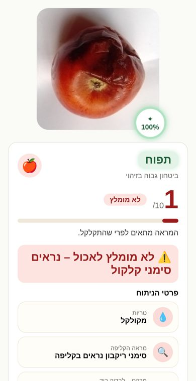
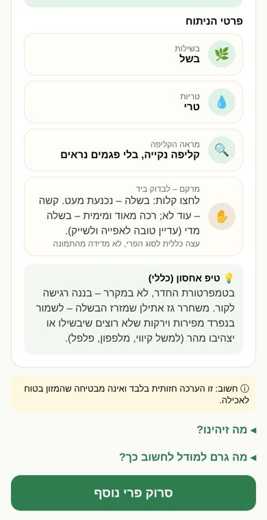
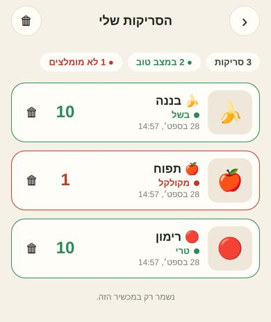
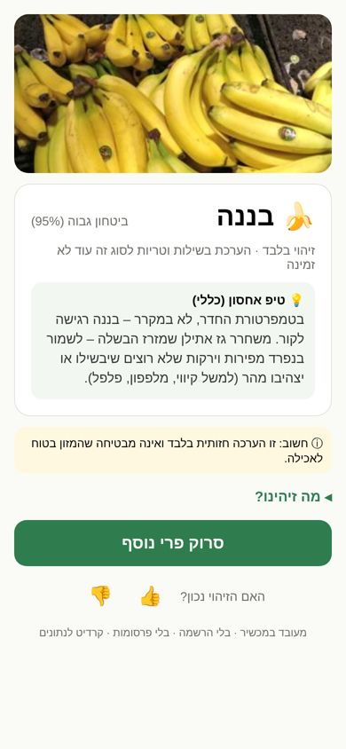
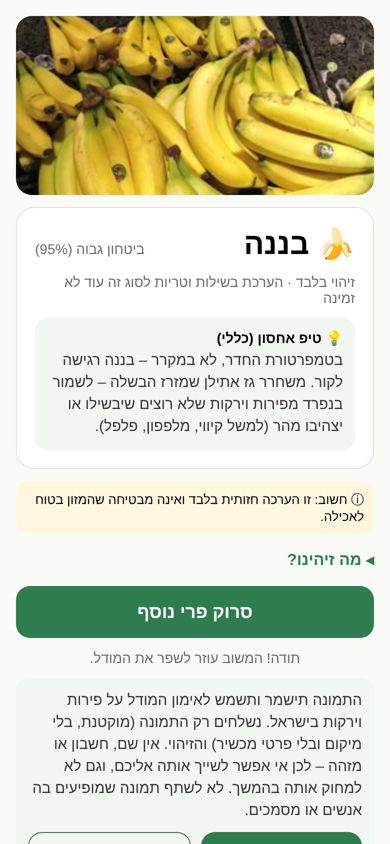
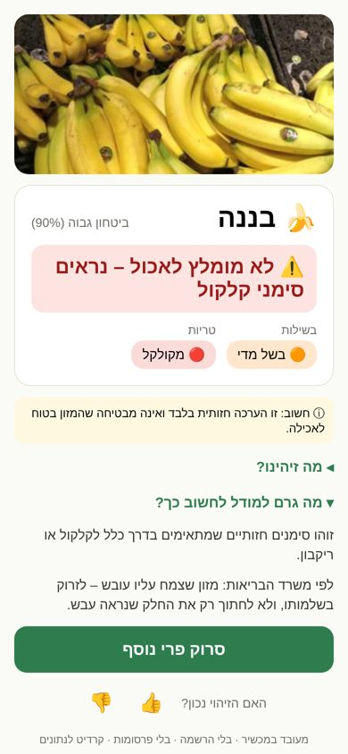

# UI review — rendered screens (2026-09-26)

Rendered from the app's real screens with `react-native-web` at 390×844 in RTL, driven by real
`decide()` outputs (a temporary demo route, removed after capture). The camera screen uses Chromium's
fake camera feed (green test pattern). Native iOS still has to be checked on a device (Phase 6/7).
Demo photo: Grocery Store Dataset (MIT, Klasson et al. 2019).

| Camera | Identify only (today's real state) | Assessment available | Medium confidence |
|---|---|---|---|
|  |  |  |  |

| Spoiled → red "don't eat" | Unsure → second angle | Bad photo | Not produce |
|---|---|---|---|
|  |  |  |  |

## Result screen redesign (2026-09-28, model v0.7-dev)

Same layout as the web result page: square photo with the confidence ring, name pill + fruit bubble,
score /10 with a one-word verdict and bar, and "פרטי הניתוח" rows. New rows: **מראה הקליפה** (skin
appearance in words, derived only from the freshness/spoilage heads) and **מרקם – לבדוק ביד** (general
hand check per type, labelled as not measured from the photo). Rendered the same way (temporary demo
route fed with real server outputs, RTL set on the document because react-native-web ignores forceRTL).

| Spoiled apple | Banana: details rows |
|---|---|
|  |  |

**My scans** (app, device only): opened from the camera screen; successful scans are kept with a small
thumbnail (history/ in the app's documents, at most 30); tap reopens the result without feedback/share
prompts; delete one or all. In the web preview the thumbnails fall back to the fruit emoji (no device
file system there).

## Problems found by rendering, and fixes

| # | Problem (first render) | Fix |
|---|---|---|
| 1 | Identify-only result: big green headline "לא ניתן להעריך בוודאות – מומלץ לבדוק ידנית" undercut a 95%-confident identification; two grey "not available" chips wasted space | Headline shown only when ripeness/freshness is actually assessed; otherwise one quiet line "זיהוי בלבד · …", and the storage tip becomes the useful action |
| 2 | A 45%-confidence answer was shown as a result labelled "ביטחון נמוך" (threshold tuned to 0.30) | Product floor: an answer is shown only at ≥ 0.70 (`UX_MIN_SHOWN_CONFIDENCE`); re-measured on test: shown 61.3% (was 63.0%), accuracy when shown 94.3% (was 93.0%) |
| 3 | "לא מומלץ לאכול" rendered in green | Headline colour/icon follows the recommendation: ✅ green eat · 🕒 amber wait · ⏳ amber soon · ⚠️ red discard |
| 4 | Storage tip shown for spoiled produce | Hidden when the recommendation is discard |
| 5 | Error states had no title, showed the "visual assessment" disclaimer with no assessment, and used an outline button for their only action | Icon + title per state; disclaimer only on assessments; filled primary button |
| 6 | Text hard-aligned `left` (relied on iOS mirroring; broke on web) | Natural alignment everywhere; RLM before the ⓘ disclaimer (ⓘ is bidi-L) |
| 7 | Disclosure arrows pointed the LTR way | `◂` collapsed / `▾` expanded |

## 2026-09-27 additions: produce care, mould rule, photo donation

| Storage tip with ethylene rule | Photo donation: per-photo consent | "Discard" explains the Ministry of Health mould rule |
|---|---|---|
|  |  |  |

- The donation offer appears only **after** the user answers "was it right?", and never before a result. It is a secondary button. The consent text is shown in full before anything is sent, and applies to that photo only. The consent text says plainly that the photo is anonymous and therefore cannot be deleted later.
- In this render, "send" ends in the "failed, try again" state, because Supabase is not reachable from the build container. The same policies were verified in SQL as the anonymous role (server/supabase/migrations/003_photo_donations.sql).
- The tip is longer now, because it includes the ethylene rule. It stays inside the tip card, below the answer, and is hidden when the recommendation is "discard".
